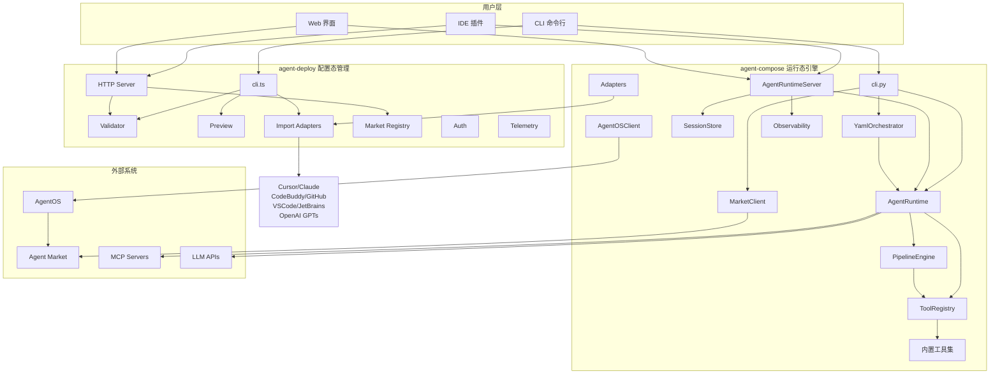
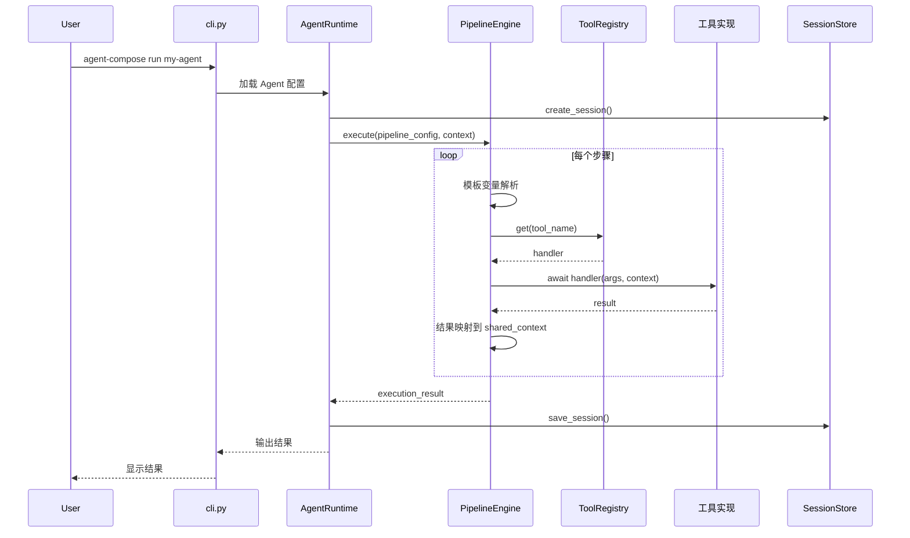
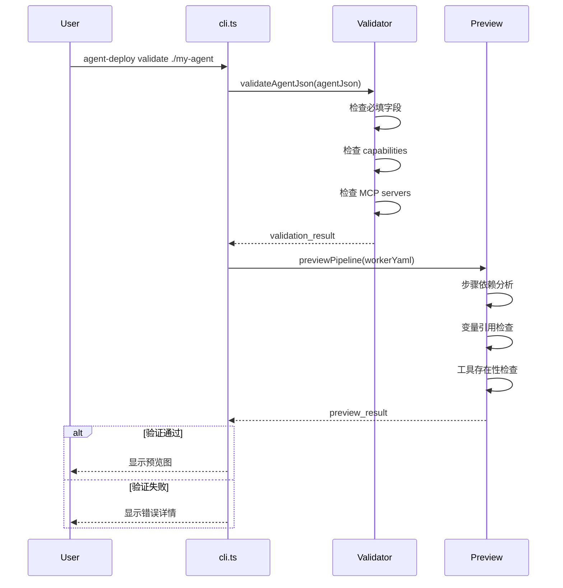

# Agent 平台架构设计文档

## 1. 概述

本项目由两个核心模块组成：

- **agent-compose**（Python）：运行态引擎，负责 Agent 的执行、编排、状态管理和工具调用
- **agent-deploy**（TypeScript/Node）：配置态管理，负责 Agent 的配置验证、跨平台适配、Market 分发和部署安装

设计原则：**compose 管执行，deploy 管配置**。Agent 的运行时能力集中在 agent-compose，agent-deploy 不直接执行 Agent，而是通过配置管理和外部系统交互来落地。

## 2. 模块关系



## 3. agent-compose 架构

### 3.1 核心组件

| 组件 | 职责 | 关键类/函数 |
|------|------|------------|
| AgentRuntime | Agent 执行入口 | `AgentRuntime.chat()`, `AgentRuntime.execute_pipeline()` |
| AgentRuntimeServer | HTTP 服务化封装 | `AgentRuntimeServer.serve()`, REST API 端点 |
| PipelineEngine | Pipeline 执行引擎 | `PipelineEngine.execute()`, 步骤调度、错误处理 |
| ToolRegistry | 工具注册与查找 | `ToolRegistry.register()`, `ToolRegistry.get()` |
| SessionStore | 会话状态持久化 | `MemorySessionStore`, `FileSessionStore`, `RedisSessionStore` |
| AgentOSClient | AgentOS 集成 | `AgentOSClient.register()`, 心跳、状态同步 |

> **注意**: `AgentOSClient.register()` 当前为占位/mock 实现，尚未对接真实 AgentOS 服务。
| Observability | 可观测性门面 | `Observability.log_pipeline_start()`, 指标、追踪 |
| MarketClient | Market 交互 | `MarketClient.upload_agent()`, `MarketClient.download_agent()` |

### 3.2 数据流



### 3.3 Agent JSON v2 结构

```json
{
  "schema_version": "2.0",
  "identity": {
    "name": "agent-name",
    "version": "1.0.0",
    "display_name": "Display Name",
    "description": "Agent description",
    "author": "Author Name",
    "tags": ["tag1", "tag2"]
  },
  "instructions": {
    "format": "markdown",
    "source": "inline",
    "content": "# Instructions\n\nDo something..."
  },
  "capabilities": ["web_search", "bash"],
  "compatibility": {
    "source": "cursor",
    "original_path": ".cursor/commands/my-agent.md"
  }
}
```

### 3.4 worker.yaml 结构

```yaml
tools:
  - name: bash
  - name: read_file

shared_context:
  project_dir: "./src"

pipeline:
  - step: read_config
    tool: read_file
    args:
      path: "config.json"
    result: config

  - step: analyze
    tool: llm_chat
    args:
      prompt: "Analyze {{config}}"
    when: "{{config}} != {}"

  - step: write_result
    tool: write_file
    args:
      path: "output.txt"
      content: "{{steps.analyze.output}}"
```

## 4. agent-deploy 架构

### 4.1 核心组件

| 组件 | 职责 | 关键类/函数 |
|------|------|------------|
| CLI | 命令行入口 | `handleValidateCommand()`, `handlePreviewCommand()` |
| HTTP Server | 配置服务 | 验证、预览、Market 查询端点 |
| Validator | 配置验证 | `validateAgentJson()`, `validateWorkerYaml()` |
| Preview | 执行预览 | `previewPipeline()`, `dryRunPipeline()` |
| Import Adapters | 跨平台导入 | `CursorImportAdapter`, `ClaudeImportAdapter`, `VSCodeImportAdapter` 等 |
| Market Registry | Market 服务 | 代理发现、版本管理 |

### 4.2 配置验证流程



## 5. 模块间通信

### 5.1 HTTP API

agent-compose 的 `AgentRuntimeServer` 提供 REST API：

| 端点 | 方法 | 功能 |
|------|------|------|
| `/sessions` | POST | 创建会话 |
| `/sessions/:id/message` | POST | 发送消息 |
| `/sessions/:id` | GET | 获取会话状态 |
| `/sessions/:id` | DELETE | 删除会话 |
| `/health` | GET | 健康检查 |
| `/ready` | GET | 就绪检查 |
| `/metrics` | GET | Prometheus 指标 |

### 5.2 MCP 协议

MCP（Model Context Protocol）用于与外部工具服务器通信：

- **stdio 传输**: 本地子进程通信
- **SSE 传输**: HTTP Server-Sent Events
- **WebBridge**: Kimi 等平台的桥接协议

### 5.3 文件系统

- Agent 定义：`agent.json` + `worker.yaml`
- 会话状态：`sessions/` 目录
- 本地缓存：`~/.cache/agent-compose/`
- 日志文件：`logs/` 目录

## 6. 安全设计

### 6.1 策略分级

| 级别 | allowBash | allowNetwork | maxFileSize | maxExecutionTime |
|------|-----------|--------------|-------------|------------------|
| restricted | false | false | 10MB | 5min |
| standard | false | true | 50MB | 10min |
| trusted | true | true | 100MB | 10min |

### 6.2 安全机制

- **危险命令检测**: bash 工具拦截 `rm -rf /` 等危险命令
- **路径黑名单**: read_file/write_file 阻止访问系统敏感目录
- **SSRF 防护**: web_fetch 拦截内部 IP 地址访问
- **网络白名单**: 可配置允许访问的域名列表

## 7. 可观测性

### 7.1 日志

结构化 JSON 日志，包含 trace_id、span_id、agent_id 等上下文：

```json
{
  "timestamp": "2024-01-15T10:30:00.123Z",
  "level": "INFO",
  "message": "Pipeline execution started",
  "logger": "agent-compose",
  "trace_id": "abc-123",
  "extra": {"agent_id": "my-agent", "pipeline_name": "default"}
}
```

### 7.2 指标

Prometheus 兼容格式：

```
agent_compose_pipeline_executions_total{agent_id="my-agent"} 42
agent_compose_step_duration_ms{tool="bash"} 150.5
agent_compose_tool_calls_total{tool="llm_chat",status="success"} 128
```

### 7.3 追踪

OpenTelemetry 风格的 Span 追踪：

```
[trace: abc-123]
  ├── span: pipeline_execution (1500ms)
  │   ├── span: step_read_config (50ms)
  │   ├── span: step_analyze (1200ms)
  │   │   └── event: llm_call
  │   └── span: step_write_result (20ms)
```

## 8. 模块清单

### 8.1 agent-compose 核心模块

| 模块 | 职责 |
|------|------|
| `agent_runtime.py` | Agent JSON v2 执行引擎 |
| `cli.py` | 命令行主入口 |
| `orchestrator.py` | YAML 编排统一入口 |
| `pipeline_engine.py` | Pipeline 执行引擎 |
| `tool_registry.py` | 工具注册与查找 |
| `session_store.py` | 会话状态持久化 |
| `agent_os_client.py` | AgentOS 集成客户端 |
| `observability.py` | 可观测性门面 |
| `market_client.py` | Market 交互客户端 |
| `resilience.py` | 重试、熔断、降级等弹性机制 |
| `resource_limits.py` | 资源限制管理（内存、执行时间等） |
| `hot_reload.py` | 配置热重载支持 |
| `log_rotation.py` | 日志轮转管理 |
| `wizard.py` | 交互式创建向导 |
| `templates.py` | Agent/Team/Workflow 模板管理 |
| `i18n.py` | 国际化支持 |

### 8.2 agent-deploy 核心模块

| 模块 | 职责 |
|------|------|
| `cli.ts` | 命令行入口 |
| `index.ts` | MCP Server |
| `adapt.ts` | Export 适配器 |
| `import.ts` | Import 管理器 |
| `market.ts` | Market 客户端 |
| `runtime/agent-executor.ts` | Agent 执行编排 |
| `runtime/pipeline.ts` | Pipeline 引擎 |
| `runtime/tools/` | 内置工具集 |
| `runtime/builtin-tools/` | invoke_agent / list_agents |
| `runtime/mcp-integration.ts` | MCP 工具集成 |
| `runtime/skill-integration.ts` | Skill 集成 |
